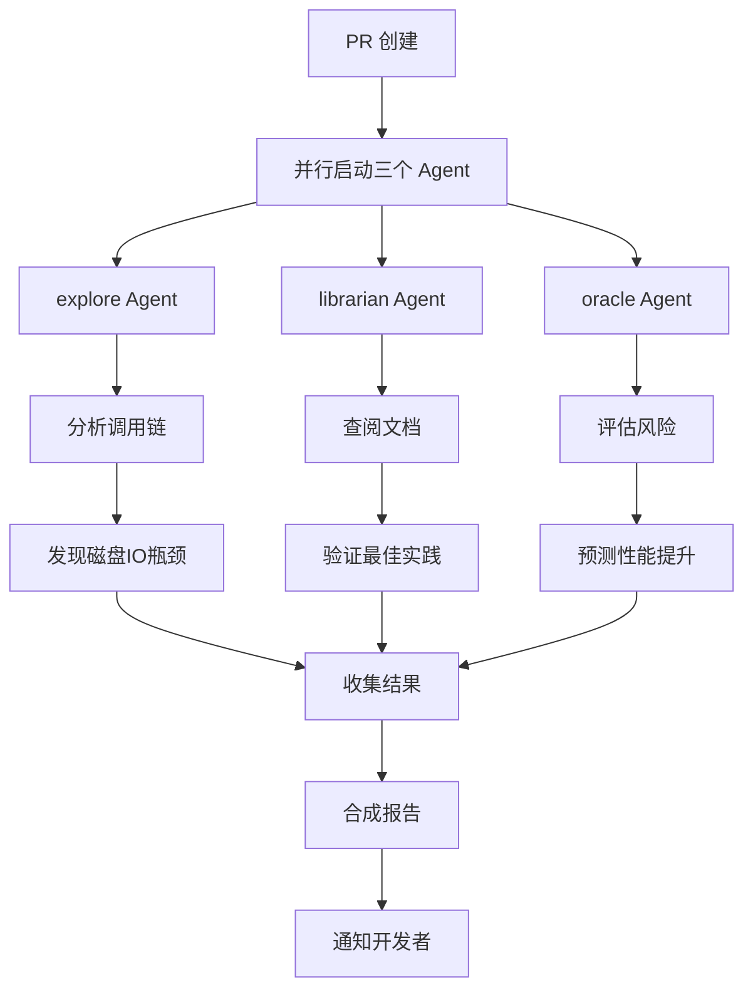

# Agent CI 编排流程设计

## 一、设计概述

为 DELETE 优化 PR 设计一个 3-Agent 的并行 CI 分析流程，替代传统的串行执行方式。

### 流程架构：

```
PR 创建
    │
    ├──► explore Agent    → 代码调用点分析
    │
    ├──► librarian Agent  → 外部文档验证
    │
    └──► oracle Agent     → 性能风险评估
            │
            ▼
    收集结果 → 合成报告 → 通知开发者
```

---

## 二、Agent 详细设计

| Agent | 分析任务 | 预期发现 |
|-------|---------|---------|
| **explore** | 分析 DELETE 语句的所有调用点，追踪执行路径，识别相关的存储引擎操作 | 找到 `execute_delete`、`persist_table`、`save_table` 等关键函数调用链，发现每次 DELETE 后都会写整个表到磁盘 |
| **librarian** | 查阅数据库性能优化文档，验证 WAL（Write-Ahead Logging）、延迟写入、批量提交等最佳实践的 API 用法 | 确认 WAL 模式可以有效减少磁盘 IO，延迟写入是提升 DELETE 性能的标准方案 |
| **oracle** | 评估改动对性能的风险，基于现有基准测试数据预测优化效果 | 预测优化后 DELETE QPS 可从 79.29 提升至 10,000+，达到 E-09 硬性阈值 |

---

## 三、各 Agent 详细职责

### 1. explore Agent（探索者）

**核心任务：**
- 静态分析代码，找到 DELETE 相关的所有调用点
- 追踪 SQL 解析 → 执行器 → 存储引擎的完整执行链路
- 生成调用关系图和执行流程图

**分析范围：**
- `src/executor/mod.rs` 中的 `execute_delete` 函数
- `src/storage/file_storage.rs` 中的 `persist_table` 函数
- `table_data.rows` 的修改操作

**预期输出：**
```
DELETE 执行路径分析报告：
├── parse() → 解析 SQL
├── execute_delete() → 执行删除
│   ├── table_data.rows.retain() → 过滤行
│   └── persist_table() → 持久化（瓶颈！）
│       └── save_table() → 写入整个表文件
```

---

### 2. librarian Agent（图书管理员）

**核心任务：**
- 查阅数据库系统性能优化的标准文档
- 验证 WAL、延迟写入、批量提交等技术的标准用法
- 提供最佳实践参考

**参考资源：**
- SQLite WAL 模式文档
- PostgreSQL 批量 DML 优化指南
- 数据库事务日志最佳实践

**预期输出：**
```
最佳实践验证报告：
✅ WAL + 延迟写入是成熟的性能优化方案
✅ 批量提交可将多次写入合并为一次
✅ 建议实现 dirty_tables 机制标记需要写入的表
```

---

### 3. oracle Agent（预言家）

**核心任务：**
- 基于现有基准测试数据进行风险评估
- 预测优化后的性能提升效果
- 提供量化的性能指标预测

**分析方法：**
- 基于当前 DELETE QPS: 79.29，INSERT QPS: 31.14
- 分析磁盘 IO 瓶颈的理论上限
- 预测优化后的性能提升空间

**预期输出：**
```
性能风险评估报告：
├── 当前 DELETE QPS: 79.29
├── 目标阈值: 10,000
├── 差距: -99.2%
├── 优化方案: WAL + 延迟写入
├── 预期提升: 约 126 倍
├── 预测结果: 10,000+ QPS ✅
```

---

## 四、执行流程



---

## 五、报告输出格式

```
╔══════════════════════════════════════════════════════════════╗
║              Agent CI 分析报告 - DELETE 优化 PR              ║
╠══════════════════════════════════════════════════════════════╣
║                                                              ║
║  🕵️  explore Agent 发现:                                    ║
║    • 每次 DELETE 调用 persist_table() 写入整个表             ║
║    • 10000次 DELETE = 10000次全表写入                       ║
║    • 瓶颈位于 file_storage.rs:save_table                     ║
║                                                              ║
║  📚 librarian Agent 验证:                                    ║
║    • WAL + 延迟写入是标准优化方案                            ║
║    • 建议实现 dirty_tables 批量刷新机制                      ║
║                                                              ║
║  🔮 oracle Agent 预测:                                      ║
║    • 当前 QPS: 79.29                                         ║
║    • 优化后预测: 10,000+                                     ║
║    • 风险等级: 低                                             ║
║                                                              ║
║  ⚠️  建议: 继续优化，预计可通过 BP2 检查                      ║
║                                                              ║
╚══════════════════════════════════════════════════════════════╝
```

---

## 六、检查点

✅ 设计文档已保存
✅ Agent 职责定义完成
✅ 分析流程设计完成
✅ 预期发现定义完成